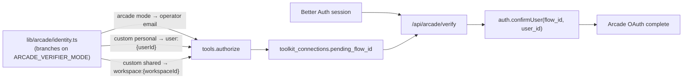

# AIG control plane roadmap

**Branch state:** synced through `efa387a`, with the current uncommitted
production env/origin polish documented below.

---

## Phase 1 — Arcade identity + scoped connections ✅

### End state



### Key files

| Area | Path |
| ---- | ---- |
| ADRs | [docs/adr/0009](docs/adr/0009-control-plane-architecture.md), [docs/adr/0010](docs/adr/0010-arcade-custom-verifier-and-connection-scope.md) (amended) |
| Identity | [lib/arcade/identity.ts](lib/arcade/identity.ts), [lib/env.ts](lib/env.ts) (`getArcadeVerifierMode`) |
| Verifier | [lib/arcade/verifier.ts](lib/arcade/verifier.ts), [app/api/arcade/verify/route.ts](app/api/arcade/verify/route.ts) |
| Connections | [app/api/connections/route.ts](app/api/connections/route.ts), [lib/db/connection-queries.ts](lib/db/connection-queries.ts) |
| Provider readiness | [lib/arcade/auth-providers.ts](lib/arcade/auth-providers.ts), [components/settings/auth-providers-panel.tsx](components/settings/auth-providers-panel.tsx) |
| Executor | [lib/aig/executor.ts](lib/aig/executor.ts), [lib/aig/connection-auth.ts](lib/aig/connection-auth.ts) |

---

## Phase 2 — Intent UI + live auth sync ✅

| Deliverable | Path |
| ----------- | ---- |
| Modern-retro design tokens | [app/globals.css](app/globals.css) |
| DAG canvas + list fallback | [components/intent/intent-canvas.tsx](components/intent/intent-canvas.tsx) |
| Side panel (Overview / Details, args editor) | [components/intent/intent-side-panel.tsx](components/intent/intent-side-panel.tsx) |
| Co-authorship trace drawer | [components/intent/intent-trace-drawer.tsx](components/intent/intent-trace-drawer.tsx) |
| Typed args form + JSON fallback | [lib/display/args-form.ts](lib/display/args-form.ts) |
| Live OAuth sync (no manual refresh) | [lib/intent/authorization-sync.ts](lib/intent/authorization-sync.ts) |
| Intent Authorize → connections POST | [intent-side-panel.tsx](components/intent/intent-side-panel.tsx) (stores `pending_flow_id`) |
| App shell + session-gate proxy | [app/app/layout.tsx](app/app/layout.tsx), [proxy.ts](proxy.ts) |

---

## Phase 3 — Polish + dev/prod verifier ✅

The big set of follow-up changes after the WIP commit:

| Change | Path |
| ------ | ---- |
| Dev/prod verifier mode env | [lib/env.ts](lib/env.ts) `getArcadeVerifierMode()` / `usesArcadeUserVerifier()` |
| Identity branches on mode | [lib/arcade/identity.ts](lib/arcade/identity.ts) |
| `authorize` omits `next_uri` in `arcade` mode | [lib/arcade/authorize.ts](lib/arcade/authorize.ts) |
| Arcade provider revoke (`admin.userConnections`) | [lib/arcade/authorize.ts](lib/arcade/authorize.ts) `revokeUserConnection` |
| Scoped removal — revoke + reauthorize remaining | [app/api/connections/[toolkit]/route.ts](app/api/connections/[toolkit]/route.ts) DELETE |
| List-time connection sync | [app/api/connections/route.ts](app/api/connections/route.ts) `syncPendingConnections` |
| New-tab OAuth + visibility refresh | [components/connections/connections-client.tsx](components/connections/connections-client.tsx), [components/intent/intent-side-panel.tsx](components/intent/intent-side-panel.tsx) |
| Radix Dialog primitive (no native confirms) | [components/ui/dialog.tsx](components/ui/dialog.tsx) |
| Remove-toolkit confirmation dialog | [components/connections/connections-client.tsx](components/connections/connections-client.tsx) `RemoveToolkitDialog` |
| Next 16 proxy migration | [proxy.ts](proxy.ts) (was `middleware.ts`) |
| Auth-provider DTO exposes verifier mode | [app/api/auth-providers/route.ts](app/api/auth-providers/route.ts), [components/settings/auth-providers-panel.tsx](components/settings/auth-providers-panel.tsx) |
| Playwright magic-link auth fixtures | [tests/e2e/fixtures/auth.ts](tests/e2e/fixtures/auth.ts), [app/api/test/magic-link/route.ts](app/api/test/magic-link/route.ts) |
| Pipelines (Sprint 3) | [lib/aig/pipeline.ts](lib/aig/pipeline.ts), [lib/db/pipeline-queries.ts](lib/db/pipeline-queries.ts), [app/api/pipelines/](app/api/pipelines), [components/pipelines/](components/pipelines) |
| Insights (Sprint 5) | [lib/db/insights-queries.ts](lib/db/insights-queries.ts), [app/api/insights/](app/api/insights), [components/insights/](components/insights) |
| UNCERTAIN badge split | [lib/display/intent-status.ts](lib/display/intent-status.ts), [components/intent/intent-dashboard.tsx](components/intent/intent-dashboard.tsx) |

Docs/rules refresh (this pass):

| File | What changed |
| ---- | ------------ |
| [AGENTS.md](AGENTS.md) | `proxy.ts`, Dialog primitive, verifier-mode identity table, OAuth UX invariants, UI conventions |
| [.cursor/rules/00-architecture.mdc](.cursor/rules/00-architecture.mdc) | Pipelines/insights/connections sync placement, UI conventions block |
| [.cursor/rules/30-arcade.mdc](.cursor/rules/30-arcade.mdc) | OAuth UX, scoped revocation, admin.* preference |
| [.cursor/rules/45-engineering-standards.mdc](.cursor/rules/45-engineering-standards.mdc) | UI conventions (no native dialogs) |
| [docs/adr/0010](docs/adr/0010-arcade-custom-verifier-and-connection-scope.md) | Amendments — dev/prod mode, scoped removal, list-time sync, proxy |
| [README.md](README.md) | Surface table updated to Shipped; verifier mode in setup |
| [CONTRIBUTING.md](CONTRIBUTING.md) | Dev vs prod verifier mode setup |

---

## Phase 6 — Production cutover 🔲

**Goal:** Flip the deployed tenant to `custom` verifier mode and run an end-to-end
authorized intent in production.

| Task | Owner | Notes |
| ---- | ----- | ----- |
| Custom domain in Vercel | Manual | `https://arcadeintentgraph.xyz` must be bound before prod E2E |
| Resend sender domain | Manual | Verify `updates.arcadeintentgraph.xyz`; prod `EMAIL_FROM` uses that subdomain |
| Custom verifier URL in Arcade Dashboard | Manual | `https://arcadeintentgraph.xyz/api/arcade/verify` |
| Google OAuth app in Arcade Dashboard | Manual | One app covers all Google toolkits |
| Prod/preview auth origin | Code | `getPublicAppOrigin()` uses `BETTER_AUTH_URL` in prod and `VERCEL_URL` in preview |
| Push branch + verify intent Authorize round-trip | Code | Already wired; production defaults to custom verifier mode |
| Playwright magic-link auth (replace `E2E_SKIP_AUTH=1` incrementally) | Code | Fixtures already in place |

**Quality gate before push:**

```bash
pnpm typecheck && pnpm check:boundaries && pnpm test:unit && EVAL_MODE=mock pnpm test:eval
```

---

## Phase 7 — Approval policies + team settings (Sprint 4) 🟡

First non-manual slice is implemented:

| Deliverable | Path |
| ----------- | ---- |
| Pure wildcard evaluator | [lib/aig/approval-policy.ts](lib/aig/approval-policy.ts) |
| Policy/rule schema | [lib/db/schema.ts](lib/db/schema.ts), [lib/db/migrations/0003_approval_policies.sql](lib/db/migrations/0003_approval_policies.sql) |
| DB queries | [lib/db/approval-policy-queries.ts](lib/db/approval-policy-queries.ts) |
| API routes | [app/api/approval-policies/](app/api/approval-policies) |
| Settings UI | [components/settings/approval-policies-panel.tsx](components/settings/approval-policies-panel.tsx) |
| Approve-time enforcement | [app/api/intents/[id]/approve/route.ts](app/api/intents/[id]/approve/route.ts) |
| Team/member Settings UI | [components/settings/team-panel.tsx](components/settings/team-panel.tsx), [app/api/team/](app/api/team) |
| Unit coverage | [tests/unit/approval-policy.test.ts](tests/unit/approval-policy.test.ts) |

Remaining Sprint 4 work:

- [ ] Reviewer roles beyond org owner/admin
- [x] Team invites + member management in Settings
- [ ] Audit-log filtering/export from policy decisions

Data model now includes `approval_policies` + `approval_policy_rules`; matched
rules are written into the `human_approved` mutation payload. Team settings read
Better Auth `member` rows and create/remove pending `invitation` rows.

---

## Phase 8 — Remaining product gaps 🟡

- [x] **Add action / replan** — side panel can insert a new tool call, write a
      `human_added` trace entry, and repair downstream dependents when anchored
      after an existing action.
- [x] **Pipeline-first creation** — dashboard now lists the newest pipelines
      and lets a user kick off a run from a template, not only freeform plan.
- [x] **Seeded demo pipeline** — new workspaces get a starter lead-follow-up
      pipeline addressed to the operator.

---

## SaaS north star (proposed, not in flight)

See [docs/adr/0011-saas-tenancy-and-byo-arcade.md](docs/adr/0011-saas-tenancy-and-byo-arcade.md)
for the target multi-tenant SaaS architecture (BYO Arcade per workspace,
envelope-encrypted secrets, Postgres RLS, Stripe entitlements, public REST
API, SSO/SCIM for enterprise).

Validation work happens **before** committing to that build — see
[docs/saas-validation.md](docs/saas-validation.md) for the demo plan,
design-partner experiments, pricing tests, and the decision points that
trigger each ADR-0011 phase.

---

## Explicitly out of scope (ADR-0009 §8)

Do not build without a new ADR:

- Risk scoring, predictive execution preview, cross-window merging
- Full enterprise RBAC, compensating-transaction rollback
- API-key toolkit auth (Arcade Secrets later if needed)
- Cross-email account linking in Better Auth

---

## Quality gates (every phase)

Pre-commit: biome + tsc. Pre-push: boundaries + unit + mock eval. CI: + e2e + build.

Repair prompt changes still require live eval gate: 9/9 × 3 consecutive `EVAL_MODE=live` runs.
