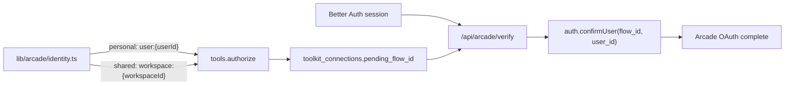

# AIG control plane roadmap

**WIP commit:** `e143d3a` — `chore: WIP checkpoint — control plane, intent UI, and Arcade OAuth`

Branch is ahead of `origin/main` by 1 commit (not pushed).

---

## Phase 1 — Arcade identity + scoped connections ✅

### Problem (solved)

AIG previously passed `session.user.email` as Arcade `user_id`, and Arcade's default verifier
required a matching arcade.dev browser session — causing `user_mismatch` when AIG email ≠
arcade.dev email, and blocking workspace-shared toolkits.

### End state (shipped)



**Implementation notes (differs from original plan draft):**

| Planned | Actually shipped |
| ------- | ---------------- |
| JWT signed with `ARCADE_VERIFIER_KEY` | Server-side `auth.confirmUser` via `ARCADE_API_KEY` ([lib/arcade/verifier.ts](lib/arcade/verifier.ts)) |
| OAuth state encodes scope | Scope resolved from `pending_flow_id` → DB row ([connection-queries.ts](lib/db/connection-queries.ts)) |
| Two stacked UI sections | Single table: toolkit × personal / workspace columns ([connections-client.tsx](components/connections/connections-client.tsx)) |

### Key files

| Area | Path |
| ---- | ---- |
| ADRs | [docs/adr/0009](docs/adr/0009-control-plane-architecture.md), [docs/adr/0010](docs/adr/0010-arcade-custom-verifier-and-connection-scope.md) |
| Identity | [lib/arcade/identity.ts](lib/arcade/identity.ts) |
| Verifier | [lib/arcade/verifier.ts](lib/arcade/verifier.ts), [app/api/arcade/verify/route.ts](app/api/arcade/verify/route.ts) |
| Connections | [app/api/connections/route.ts](app/api/connections/route.ts), [lib/db/connection-queries.ts](lib/db/connection-queries.ts) |
| Provider readiness | [lib/arcade/auth-providers.ts](lib/arcade/auth-providers.ts), [components/settings/auth-providers-panel.tsx](components/settings/auth-providers-panel.tsx) |
| Executor | [lib/aig/executor.ts](lib/aig/executor.ts), [lib/aig/connection-auth.ts](lib/aig/connection-auth.ts) |

### Manual ops still required (Phase 3 blocker)

Arcade Dashboard configuration — code cannot do this:

1. **Auth → Settings → Custom verifier:** `${BETTER_AUTH_URL}/api/arcade/verify`
2. **Connected Apps → Add OAuth Provider** per provider family (start with **Google** for Gmail)
3. See **Settings → OAuth providers** in the app for full catalog + configured status

Arcade default OAuth apps only work with the Arcade user verifier — production multi-user
requires BYO credentials per [provider family](https://docs.arcade.dev/en/references/auth-providers)
(~30 families, not per-toolkit).

---

## Phase 2 — Intent UI + live auth sync ✅

Shipped in same WIP commit.

| Deliverable | Path |
| ----------- | ---- |
| Modern-retro design tokens | [app/globals.css](app/globals.css) |
| DAG canvas + list fallback | [components/intent/intent-canvas.tsx](components/intent/intent-canvas.tsx) |
| Side panel (Overview / Details, args editor) | [components/intent/intent-side-panel.tsx](components/intent/intent-side-panel.tsx) |
| Co-authorship trace drawer | [components/intent/intent-trace-drawer.tsx](components/intent/intent-trace-drawer.tsx) |
| Typed args form + JSON fallback | [lib/display/args-form.ts](lib/display/args-form.ts) |
| Live OAuth sync (no manual refresh) | [lib/intent/authorization-sync.ts](lib/intent/authorization-sync.ts) |
| Intent Authorize → connections POST | [intent-side-panel.tsx](components/intent/intent-side-panel.tsx) (stores `pending_flow_id`) |
| App shell | [app/app/layout.tsx](app/app/layout.tsx), [components/app/](components/app/) |

**UX decisions locked in:**

- UNCERTAIN badge stays orange; canvas always selectable (inspect args while auth pending)
- Only **Approve** stays locked until OAuth clears; edit/remove args allowed earlier
- SSE stream uses auth fingerprint, not just mutation count

---

## Phase 3 — Production OAuth unblock 🔲

**Goal:** End-to-end Gmail (or any Google toolkit) connect + intent approve on a real multi-user path.

| Task | Owner | Notes |
| ---- | ----- | ----- |
| Custom verifier in Arcade Dashboard | Manual | Must match `BETTER_AUTH_URL` exactly |
| Google OAuth app in Arcade Dashboard | Manual | One app covers all Google toolkits |
| Verify intent Authorize → verify → return to intent | Code ✅ | Already wired; needs Dashboard |
| Playwright magic-link auth | Code | Replace `E2E_SKIP_AUTH=1` incrementally |
| `pnpm exec playwright install` | Local | Required before e2e locally |

**Quality gate before push:**

```bash
pnpm check:boundaries && pnpm test:unit && EVAL_MODE=mock pnpm test:eval
```

---

## Phase 4 — Pipelines (Sprint 3) 🔲

Per [ADR-0009](docs/adr/0009-control-plane-architecture.md): versioned templates promoted from runs.

- [ ] Pipeline schema (template JSON, source intent FK, version, workspace scope)
- [ ] Promote-from-run API + UI on intent detail
- [ ] Replace [app/app/pipelines/page.tsx](app/app/pipelines/page.tsx) placeholder
- [ ] Plan agent entry: "run from pipeline" vs freeform prompt

**Terminology:** a **run** = one intent lifecycle; a **pipeline** = reusable template.

---

## Phase 5 — Approval policies (Sprint 4) 🔲

- [ ] Policy rules per tool pattern (glob / toolkit / action)
- [ ] Reviewer roles beyond org owner/admin
- [ ] Team invites + member management in Settings
- [ ] Replace Settings empty state placeholder

Data model is ready: `intents.approved_by_user_id`, workspace membership via Better Auth org.

---

## Phase 6 — Insights + product gaps (Sprint 5) 🔲

- [ ] /app/insights — connection health, run throughput, audit exports
- [ ] Seeded demo pipeline for onboarding
- [ ] **Add action / replan** — no API or UI yet
- [ ] **Split UNCERTAIN** — auth-pending vs low-confidence grouping (same label today)
- [ ] **Pipeline-first creation** — create from template, not only freeform plan

---

## Explicitly out of scope (ADR-0009 §8)

Do not build without a new ADR:

- Risk scoring, predictive execution preview, cross-window merging
- Full enterprise RBAC, compensating-transaction rollback
- API-key toolkit auth (Arcade Secrets later if needed)
- Cross-email account linking in Better Auth

---

## Quality gates (every phase)

Pre-commit: biome + tsc. Pre-push: boundaries + unit + mock eval. CI: + e2e + build.

Repair prompt changes still require live eval gate: 9/9 × 3 consecutive `EVAL_MODE=live` runs.
